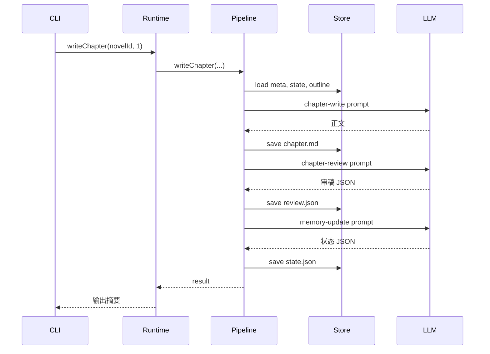

# 小说家 Agent 架构说明

本文档解释 Agent 研发链路及核心技术原理，配合源码注释一起学习。

## 1. 整体架构

```
用户 (CLI)
    │
    ▼
Agent Runtime ─── 持有 LLM Client，暴露高层任务接口
    │
    ▼
Pipeline ─── 有序步骤链：加载上下文 → LLM 调用 → 落盘
    │
    ├── Prompt 模板（outline / write / review / memory）
    ├── Novel Store（JSON + Markdown 文件）
    └── LLM Client（OpenAI-compatible API）
```

**设计原则**：

- **Runtime vs Pipeline**：Runtime 面向用户意图（「写一章」），Pipeline 面向执行步骤（加载→生成→审稿→记忆）
- **Prompt 与逻辑分离**：所有 Prompt 集中在 `src/prompts/`，便于迭代写作风格
- **生成与审稿分离**：Generate-Verify 模式，避免模型自我审稿过于宽松

## 2. Agent 核心概念

### 2.1 LLM 作为「推理引擎」

Agent 的「智能」来自 LLM。每次任务本质是：

1. **构造 messages**（system + user）
2. **调用 Chat Completions API**
3. **解析响应**（纯文本 或 JSON）

关键参数：

| 参数 | 作用 | 写作建议 | 审稿/记忆建议 |
|------|------|----------|---------------|
| temperature | 随机性 | 0.7–0.9 | 0.3–0.5 |
| max_tokens | 输出上限 | 4096+ | 2048 |
| model | 模型选择 | 按成本/质量权衡 | 同上 |

### 2.2 Prompt 工程

四类 Prompt 对应四个 Agent 能力：

| Prompt | 输入 | 输出 | 模式 |
|--------|------|------|------|
| outline | 作品设定 | JSON 大纲 | chatJson |
| chapter-write | 设定+状态+大纲 | Markdown 正文 | chat |
| chapter-review | 设定+状态+正文 | JSON 审稿 | chatJson |
| memory-update | 旧状态+正文 | JSON 新状态 | chatJson |

**上下文注入**是长篇连贯性的关键：每章写作时注入「人物状态」「上章摘要」「未回收伏笔」，而非全书正文。

### 2.3 记忆系统（Story State）

LLM 上下文窗口有限，无法塞入百万字小说。解决方案：

```
全书正文 (chapters/*.md)  ──蒸馏──▶  state.json
                                      ├── timeline
                                      ├── lastChapterSummary
                                      ├── characters[]
                                      ├── foreshadowing[]
                                      └── openThreads[]
```

每章写完后，`memory-update` 步骤从正文提取结构化状态，供下一章使用。这是 RAG/向量检索之前的**轻量替代方案**。

### 2.4 Pipeline 编排

`write-chapter` 完整链路：



步骤可独立跳过：`--skip-review`、`--skip-memory`。

## 3. 数据模型

| 文件 | 内容 | 更新频率 |
|------|------|----------|
| novel.json | 书名、题材、主角、文风 | 创建时 |
| outline.json | 分章大纲 | plan-outline |
| state.json | 故事记忆 | 每章写完后 |
| chapters/NNNN.md | 章节正文 | write-chapter |
| reviews/NNNN.json | 审稿结果 | write/review |

使用 **Zod** 同时提供 TypeScript 类型和运行时校验，尤其用于校验 LLM 返回的 JSON。

## 4. 扩展路线

### Phase 2：一致性增强

- 向量检索：对历史章节做 embedding，写作时检索相关片段
- 多轮修订：审稿不通过时自动重写
- 人物卡/世界观 Bible：更细粒度的设定约束

### Phase 3：平台集成

预留目录（尚未实现）：

```
src/platforms/
├── fanqie/     # 番茄小说
├── qidian/     # 阅文起点
└── comments/   # 评论回复
```

内容生成与平台发布**解耦**：发布失败不影响写作；发布用 Playwright 或官方 API（若有）。

## 5. 学习路径建议

1. 读 `src/config.ts` → 理解配置分离
2. 读 `src/novel/types.ts` → 理解领域模型
3. 读 `src/llm/client.ts` → 理解 LLM 调用与 JSON 解析
4. 读 `src/prompts/*.ts` → 理解 Prompt 构造
5. 读 `src/novel/pipeline.ts` → 理解步骤编排
6. 读 `src/agent/runtime.ts` → 理解 Agent 外壳
7. 运行 `npm run dry-run` → 观察完整流水线

## 6. dry-run 模式

`--dry-run` 不调用真实 API，返回预设模拟响应。用于：

- 验证 CLI 和流水线逻辑
- CI 中的集成测试
- 学习时零成本跑通全流程
